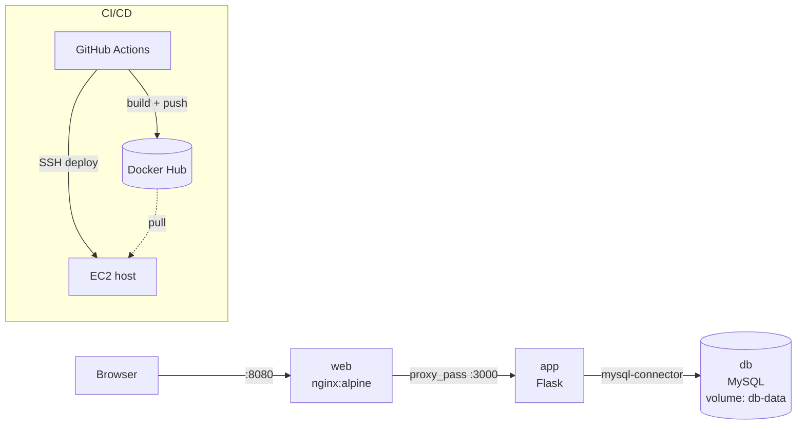

# 3-Tier App Deployment

A user-management web app split into three tiers (Nginx → Flask → MySQL), containerised with Docker Compose and shipped to an EC2 host by a GitHub Actions pipeline.

## Architecture



Only `web` publishes a port. `app` and `db` are reachable only on the Compose network.

## Stack

| Layer | Tech |
|---|---|
| Web tier | Nginx (reverse proxy) |
| App tier | Python 3.12, Flask 3, mysql-connector-python |
| Data tier | MySQL, seeded from `mysql/init.sql` |
| Packaging | Docker, Docker Compose |
| CI/CD | GitHub Actions, Docker Hub, EC2 over SSH |
| Checks | flake8, hadolint, Trivy |

## Quick start

```bash
git clone https://github.com/frenzyali/3-tier-app-deployment.git
cd 3-tier-app-deployment
cp .env.example .env        # then edit the passwords
docker compose up -d --build
```

Open http://localhost:8080. Health check: `curl http://localhost:8080/health` → `{"status":"ok"}`.

| Route | Purpose |
|---|---|
| `/` | Home |
| `/users/view`, `/users/manage` | List / add / delete users |
| `GET/POST /api/users`, `DELETE /api/users/<id>` | JSON API |
| `/health` | Liveness probe used by Compose |

## Design decisions

- **Reverse proxy in front of the app.** Nginx is the only published port, so the Flask dev server is never exposed directly.
- **Config via environment.** DB credentials come from `.env` (gitignored) through Compose substitution; `.env.example` documents the keys.
- **Healthcheck on the app container.** `/health` plus a Compose `healthcheck` with a start period gives a real "healthy" signal instead of "process started".
- **Parameterised SQL.** All queries use `%s` placeholders, so user input is never string-formatted into SQL.
- **Named volume for MySQL.** Data survives `docker compose down`; `init.sql` only seeds on first start.
- **Pipeline stages.** `ci.yml` runs test → build/push → deploy. `lint.yml` is separate so lint and scan feedback arrives on pull requests without needing deploy secrets.
- **Trivy is report-only for now.** It prints HIGH/CRITICAL findings without failing the build, so the pipeline isn't red before the pinned dependencies are reviewed.

### Known limitations

- Flask's built-in server is used in the container; a production setup would use gunicorn.
- `app.py` falls back to a default DB password if `DB_PASSWORD` is unset. Compose always sets it, but the fallback should be removed.

## Required GitHub secrets

`DOCKERHUB_USERNAME`, `DOCKERHUB_TOKEN`, `EC2_HOST`, `EC2_USER`, `EC2_SSH_KEY`.

## Cleanup

```bash
docker compose down -v          # stop containers and delete the MySQL volume
docker image rm 3-tier-app-deployment-app
rm .env
```

On the EC2 host, also stop the stack (`cd ~/myapp && docker compose down -v`), and revoke the Docker Hub token and deploy SSH key if you're retiring the project.
